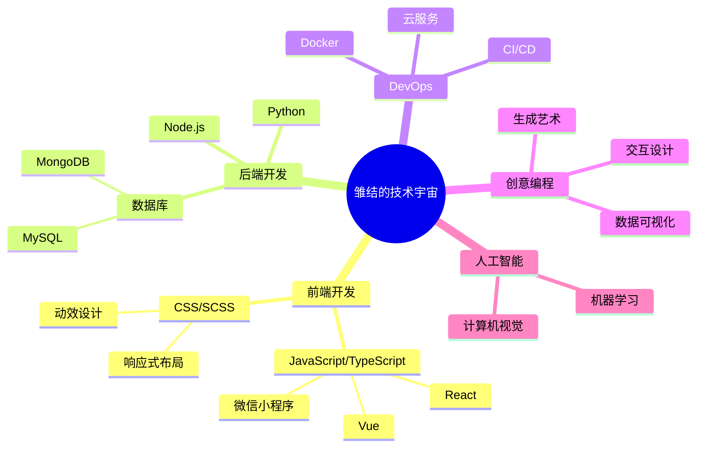

# <div align="center">欢迎光临，这里是雏结</div>

<div align="center">
  
</div>

<div align="center">
  
</div>


<!--
统计
-->
<div align="center">
  
  
  
  
  
  
  
  
</div>


<div align="center">
  
  
</div>


<!--
社交媒体
-->

<div align="center">
  <a href="https://king.kingdomofown.cn">
    
  </a>
  <a href="#">
    
  </a>
  <a href="#">
    
  </a>
</div>

<div align="center">
  
  
  
</div>


## ✨ 代码艺术空间

<div align="center">
  
```diff
@@                  我的编程哲学                   @@
@@                                                 @@
+  > 代码如诗，简洁而优雅                          +
-  > 调试如禅，耐心而专注                          -
!  > 学习无尽，进步无止                           !
#  > 创造无界，思维无限                           #
@@                                                 @@
@@         思维决定代码，代码改变世界              @@
```

</div>

## 🎭 量子终端

<div align="center">
  
```
  ____                 __  __      ____                      
 / ___|___  _ __  ___ / _|/ _|    / ___|_ __ ___  ___ __  _ 
| |   / _ \| '_ \/ __| |_| |_     | |   | '__/ _ \/ _ \\ \/ /
| |__| (_) | | | \__ \  _|  _|    | |___| | |  __/  __/>  < 
 \____\___/|_| |_|___/_| |_|       \____|_|  \___|\___/_/\_\
                                                           
$ whoami
> 雏结 - 全栈开发者、创意编码艺术家

$ ls -la ./skills
> drwxr-xr-x  前端技术  [JavaScript, React, Vue, TypeScript]
> drwxr-xr-x  后端技术  [Node.js, Python, Express, Django]
> drwxr-xr-x  视觉设计  [UI/UX, 动效设计, 插画]
> drwxr-xr-x  人工智能  [数据分析, 机器学习, 计算机视觉]

$ cat passion.md
> 技术让生活更美好
> 代码编织未来世界
> 创意无限可能
> 始终保持好奇心

$ ./evolve.sh --infinity
```

</div>

## 🌈 技能进化矩阵

<div align="center">

| 技能领域 | 掌握度 | 进化轨迹 |
|:---:|:---:|:---:|
| **前端开发** |  | ▁▃▅▇█▇▅▃▁▃▅▇█ |
| **后端开发** |  | ▁▂▃▄▅▆▇█▇▆▅▄▃▂▁ |
| **视觉设计** |  | ▇▆▅▄▃▂▁▁▂▃▄▅▆▇█ |
| **人工智能** |  | █▓▒░█▓▒░█▓▒░█▓▒░ |
| **创意编码** |  | ◢◤◢◤◢◤◢◤◢◤◢◤◢◤ |

</div>

## 🎨 创意代码艺术

<div align="center">
  
```
                                              .--.
     .----.                                  / _.-'
    /      \         代                     /.'
   |  .--.  |            码                /:'
   | (    ) |                的        _.·´|
   |  '--'  |                    心        |
    \      /       跳             .-·"¯}   |
     '----'                 .-·"¯   .·´    |
       ||             .-·"¯  _,.·´_.-·¯    |
       ||        .-·"¯  _.-·´\\.-·¯       |
       ||   .-·"¯  _.-·´_.-·´             '.
       ||.-·}  _.-·´_.-·´                  |
       ||¯¯¯¯¯¯¯¯¯¯                        |
       ||                                   |
       ||                                   '
       ||                                    '-.,_
       ||                                         '''--.,_
       ||                                                 '''--.,_
       ||                                                          '''--.,_
       ||                                                                 '-

function createWithPassion() {
  return {
    code: '优雅',
    design: '创意',
    philosophy: '简约而不简单'
  };
}
```

</div>

## 🔮 思维导图

<div align="center">
  


</div>


<div align="center">
  
</div>


