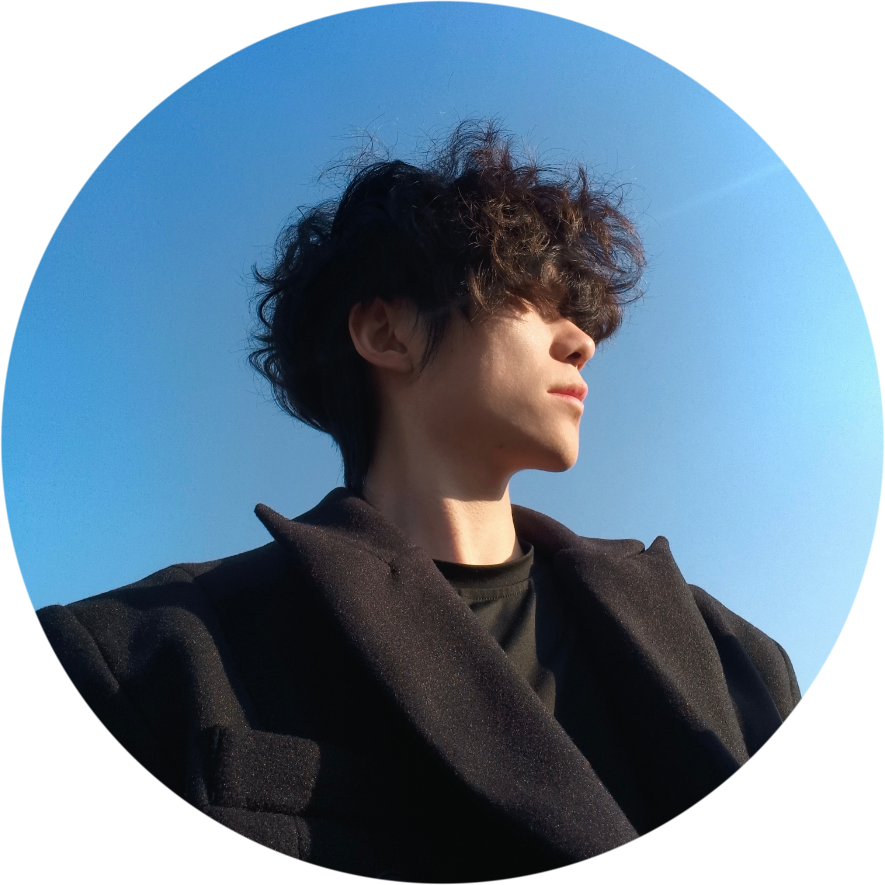

<!-- 👤 圆形头像 -->

  

 

<!-- 🌟 头部横幅 - 简笔画风 -->

  
   
  

<!-- 🐻 bear1 装饰 -->

  

<!-- ⌨️ 打字机效果 - 彩虹渐变 -->

  
   
  
   
  

   

<!-- 🌈 彩虹分隔线 -->

<!-- 🎬 Title动画 -->

  

 

<!-- 👨‍💻 关于我 -->
<h2 align="center">
  🤝  🤝
</h2>

<table align="center" border="0">
  <tr>
    <td width="50%" valign="top">
      

        
      

    </td>
    <td width="50%" valign="top">
      

        👨🏻‍💼 <b>你好！我是雏结</b> 一位全能的路人甲
          
        🌏 来自 <b>China</b> CN
          
        ❤️ 热爱 <b>旅游🎮</b> · <b>摄影📷</b> · <b>音乐🎵</b> · <b>琴棋书画🎨</b> <b>健身🏋🏻‍♂️</b> <b>篮球🏀</b>
          
        🌱 分享 <b>我的些许开源技术</b> · <b>摄影经验</b> · <b>个人想法</b>
          
        💡 I wanna say: <i>"Keep reflect, keep grow."</i>
          
        🎨 如果你也是有趣的灵魂: <b>我真希望能跟你畅聊一个晚自习</b>
      

    </td>
  </tr>
</table>

<!-- 动态分隔 -->

  

<!-- GitHub 活动统计 -->

  

 

<!-- 🛠️ 开发工具与创意 -->
<h3 align="center">🛠️ 开发工具与创意</h3>

  

 

  
  
  
  
  
  

  
  
  
  
  
  

 

<!-- 💪 技能熟练度 -->

  <h3>💪 能力等级锐评</h3>

| 技能 | 熟练度 |
|:---:|:---:|
| C/C++/ESP-IDF嵌入式开发 |  夯 |
| 摄影 |  夯 |
| React/Vue/Next.js前端开发 |  顶尖 |
| AI/MCP/Agent开发 |  顶尖 |
| 产品设计/市场调研/UI设计 |  人上人 |
| 音乐 |  人上人 |
| Express.js/Django/MySQL后端开发 |  npc |
| 社交 |  拉完了 |

 

<!-- 🔥 GitHub 统计 -->
<h2 align="center">
  🔥  🔥
</h2>

<!-- 贡献蛇图动画 -->

  <picture>
    <source media="(prefers-color-scheme: dark)" srcset="https://raw.githubusercontent.com/platane/snk/output/github-contribution-grid-snake-dark.svg" />
    <source media="(prefers-color-scheme: light)" srcset="https://raw.githubusercontent.com/platane/snk/output/github-contribution-grid-snake.svg" />
    
  </picture>

 

<!-- 🌐 联系我 -->
<h2 align="center">
  🔗  🔗
</h2>

<!-- 社交动画 -->

  

 

<!-- 社交链接 -->

  
  
  

  
  
  

 

<!-- 访客统计 -->

  
  
  

 

<!-- 🌊 底部 -->

  

